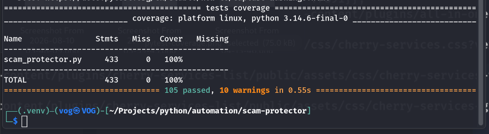
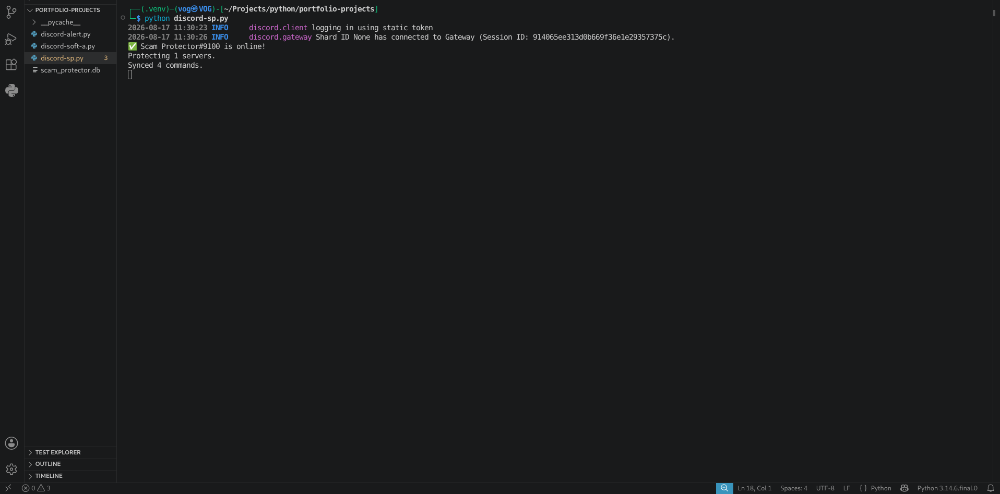
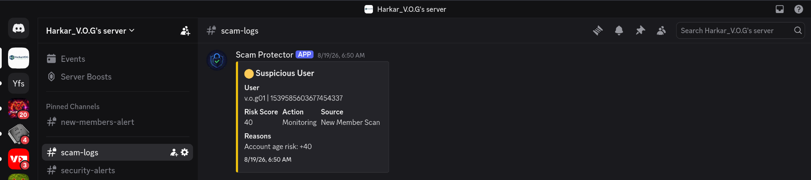
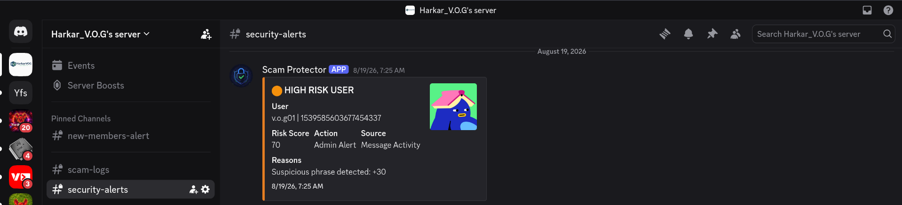
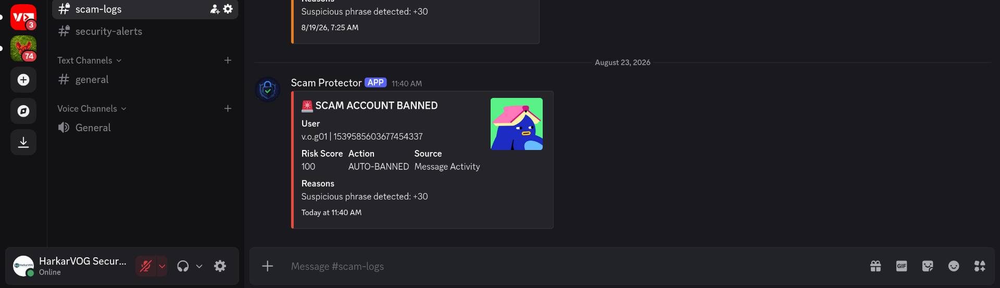
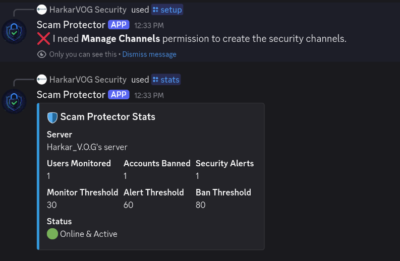
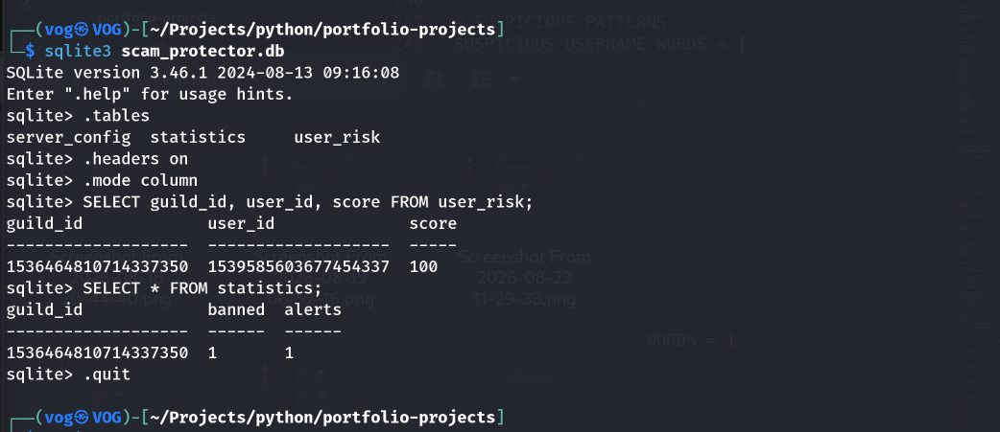
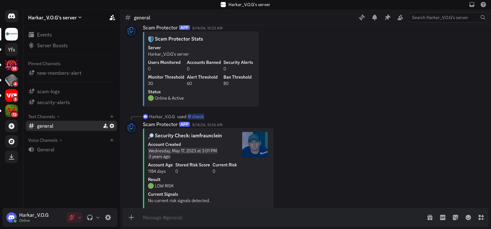

# 🛡️ Scam Protector

Scam Protector is a Discord security and moderation bot built with **Python**, **discord.py**, and **SQLite**.

The project monitors new members and message activity, calculates risk scores from multiple security signals, stores risk information persistently, generates security alerts, and can automatically ban accounts that reach the configured ban threshold.

The project also includes an automated test suite covering the bot's core security logic, database operations, event handlers, Discord command behavior, channel helpers, and moderation decisions.

---

## 🚀 Features

Scam Protector currently includes:

- 👤 New-member security monitoring
- 🧮 Risk-based account scoring
- 📅 Discord account-age analysis
- 🔎 Suspicious username detection
- 👤 Missing-profile-avatar detection
- 💬 Message risk analysis
- 🔗 URL detection in messages
- 📢 Excessive mention detection
- 🚨 `@everyone` / `@here` abuse detection
- 🟡 Monitoring threshold
- 🟠 Administrator alert threshold
- 🔴 Automatic ban threshold
- 📋 Private security logging
- 🚨 Private security alerting
- 📢 Public new-member notifications
- ⚙️ Per-server configuration
- 📊 Server security statistics
- 💾 Persistent SQLite storage
- 🔧 Configurable risk thresholds
- 🔐 Discord permission handling
- 🛡️ Automatic moderation actions
- 🧪 Automated testing with pytest
- 📈 Test coverage measurement with pytest-cov
- 🔍 Static security analysis with Bandit
- 📦 Dependency vulnerability auditing with pip-audit

---

# 🧠 Risk Scoring System

Scam Protector uses multiple signals when evaluating Discord accounts and message activity.

Instead of making a moderation decision based on only one characteristic, individual signals contribute points to a stored risk score.

```text
New Member / Message Activity
            │
            ▼
      Security Analysis
            │
            ▼
       Risk Signals
            │
            ▼
        Risk Score
            │
    ┌───────┼────────┐
    ▼       ▼        ▼
 Monitor   Alert     Ban
```

The accumulated score determines what security action the bot performs.

---

# 👤 Account Risk Analysis

When a new member joins a configured server, Scam Protector performs an initial security scan.

The current implementation evaluates signals including:

```text
Account age
Suspicious username patterns
Profile/avatar status
```

The resulting score is stored in SQLite and passed into the bot's risk-processing system.

---

## Account Age Scoring

The project includes automated tests for several account-age conditions.

Tested scenarios include:

```text
Brand-new account
Two-day-old account
Account below configured minimum age
Older established account
```

The tests verify that younger accounts receive the expected risk points while sufficiently old accounts receive no account-age risk points.

---

## Suspicious Username Detection

Scam Protector analyzes usernames and display names for configured suspicious patterns.

The automated test suite verifies both:

```text
Suspicious usernames receive risk points
Normal usernames do not receive username risk points
```

---

## Profile Risk

The bot also evaluates whether an account has a profile avatar.

The current implementation adds profile risk when an avatar is missing.

Automated tests verify:

```text
Missing avatar → profile risk added
Existing avatar → no avatar-related risk
```

---

# 💬 Message Security Analysis

Scam Protector monitors message activity inside configured Discord servers.

The current message-scoring implementation evaluates:

```text
Suspicious phrases
URLs
Excessive mentions
@everyone / @here abuse
```

Risk points from multiple signals can accumulate.

---

## Suspicious Message Phrases

Configured suspicious phrases contribute:

```text
+30 risk points
```

The message-scoring test suite verifies that configured suspicious phrases are detected correctly.

---

## URL Detection

Messages containing detected URLs contribute:

```text
+20 risk points
```

This behavior is covered by automated tests.

---

## Excessive Mentions

A message containing five or more mentions contributes:

```text
+30 risk points
```

Boundary behavior has also been tested.

```text
4 mentions → no excessive-mention risk
5 mentions → +30 risk points
```

---

## @everyone / @here Abuse

Messages triggering Discord's `mention_everyone` behavior contribute:

```text
+40 risk points
```

This behavior is included in the automated message-scoring tests.

---

## Combined Message Risk

Multiple message signals accumulate.

For example, the test suite verifies a message containing:

```text
Suspicious phrase    +30
URL                  +20
5 mentions           +30
@everyone abuse      +40
-------------------------
Total                120
```

The expected result is a total risk score of:

```text
120
```

---

# 📊 Risk Thresholds

The default thresholds used by Scam Protector are:

```text
Monitor Threshold: 30
Alert Threshold:   60
Ban Threshold:     80
```

The thresholds are configurable per Discord server.

The automated tests explicitly verify the important boundary conditions:

```text
29 → No action
30 → Monitoring
59 → Monitoring
60 → Administrator alert
79 → Administrator alert
80 → Automatic ban
>80 → Automatic ban
```

This verifies that actions occur at the intended threshold boundaries.

---

# 🟡 Monitoring

When a user's score reaches the monitor threshold but remains below the alert threshold, Scam Protector creates a suspicious-user security event.

The event includes information such as:

```text
User
Risk Score
Action
Source
Reasons
```

Monitoring events are sent to the configured private security log channel.

---

# 🟠 High-Risk Administrator Alerts

When a score reaches the alert threshold but remains below the ban threshold, Scam Protector generates a high-risk administrator alert.

The event records:

```text
User
Risk Score
Action
Source
Reasons
```

The bot also increments the server's stored alert statistics.

The event is sent to the configured security logging and alert channels.

---

# 🚨 Automatic Ban

When a user's score reaches or exceeds the configured ban threshold, Scam Protector attempts to automatically ban the member.

The ban reason contains the Scam Protector risk score.

After a successful ban, the bot:

```text
Increments the server's banned-account statistics
Creates a security event
Records the risk score
Records the source
Records the risk reasons
Sends the event to security logs
Sends an urgent security alert
```

---

# ⚠️ Ban Failure Handling

Automatic moderation can fail when Discord permissions or role hierarchy prevent the bot from banning a member.

Scam Protector handles `discord.Forbidden` failures instead of allowing the application to crash.

When this occurs, the bot creates a:

```text
⚠️ BAN FAILED
```

security event explaining that the bot may lack the required **Ban Members** permission or sufficient role hierarchy.

Automated tests verify that:

```text
Failed bans are logged
Failed bans generate security alerts
Failed bans do not crash risk processing
The failure embed contains the risk score
The failure explains the permission problem
```

---

# 📢 New-Member Event Handling

When a member joins a configured server, Scam Protector:

```text
Loads the server configuration
Performs the initial security scan
Stores the resulting risk score
Creates a new-member notification
Sends the public notification
Processes the member's security risk
```

The public notification includes information such as:

```text
Member
Account Age
Risk Score
```

Automated tests cover both configured and unconfigured server behavior.

---

# 💬 Message Event Handling

Scam Protector ignores messages sent by bots.

Direct messages are passed to Discord command processing without performing server risk analysis.

For messages inside configured servers, Scam Protector:

```text
Analyzes the message
Calculates message risk points
Updates the user's stored risk score when necessary
Processes the resulting risk
Continues command processing
```

Automated tests verify:

```text
Bot messages are ignored
Direct messages are passed to command processing
Unconfigured servers skip risk scanning
Safe messages do not add risk
Risky messages add risk
Risky messages trigger risk processing
```

---

# 🔐 Security Channels

Scam Protector separates general server notifications from sensitive security information.

A configured server can use:

```text
Discord Server
│
├── #general
│   └── Public new-member notifications
│
├── #scam-logs
│   └── Private security logs
│
└── #security-alerts
    └── Private administrator alerts
```

The `/setup` command can create the security channels when they do not already exist.

The security channels are configured so that the server's default role cannot view them while the bot receives the permissions required to operate inside them.

---

# 🔧 Channel Resolution

Scam Protector includes a channel helper that first attempts to retrieve a channel from the guild's cached channels.

If the channel is unavailable from the cache, the bot attempts to fetch it through Discord.

The helper handles:

```text
discord.NotFound
discord.Forbidden
discord.HTTPException
```

Automated tests verify cached-channel retrieval, remote fetching, missing channels, and permission failures.

---

# ⚙️ Discord Commands

## `/setup`

Configures Scam Protector for a Discord server.

The command accepts:

```text
General notification channel
Minimum account age
Monitor threshold
Alert threshold
Ban threshold
```

The command validates that:

```text
It is being used inside a server
Minimum account age is not negative
Monitor < Alert < Ban
The bot exists as a guild member
The bot has Manage Channels permission
```

It then creates or configures:

```text
#scam-logs
#security-alerts
```

and stores the server configuration in SQLite.

Automated tests cover the major validation and successful setup paths.

---

## `/check`

Checks the security profile of a selected server member.

The command evaluates:

```text
Account creation date
Account age
Stored risk score
Current scan score
Overall risk classification
Current security signals
```

The command uses the higher value between the stored risk score and current scan result when presenting the estimated risk.

Automated tests verify classification as:

```text
🟢 LOW RISK
🟡 MONITOR
🟠 SUSPICIOUS
🚨 HIGH RISK
```

Tests also verify the comparison between stored and current risk scores.

---

## `/config`

Displays the current Scam Protector configuration for the server.

The configuration includes:

```text
General channel
Security log channel
Security alert channel
Minimum account age
Monitor threshold
Alert threshold
Ban threshold
Status
```

The command also handles missing configured channels.

Automated tests are included for the configuration command.

---

## `/stats`

Displays stored security statistics for the current Discord server.

The statistics include:

```text
Users monitored
Accounts banned
Security alerts
Monitor threshold
Alert threshold
Ban threshold
Protection status
```

The command reads the server's information from SQLite.

Automated tests verify:

```text
DM rejection
Unconfigured-server handling
Successful statistics display
```

---

# 🗄️ SQLite Persistence

Scam Protector uses SQLite for persistent application data.

The database contains three primary tables:

```text
server_config
user_risk
statistics
```

---

## `server_config`

Stores server-specific configuration including:

```text
Guild ID
Log channel ID
Alert channel ID
General channel ID
Minimum account age
Monitor threshold
Alert threshold
Ban threshold
```

---

## `user_risk`

Stores accumulated user risk information.

```text
Guild ID
User ID
Risk Score
```

The combination of guild ID and user ID is used as the primary key.

---

## `statistics`

Stores server-level security statistics.

```text
Guild ID
Banned accounts
Security alerts
```

---

## Database Testing

Automated tests cover database functionality including server configuration, user risk scoring, and stored statistics.

The local runtime database is excluded from Git.

---

# 🧪 Automated Testing

Scam Protector currently has an automated pytest test suite covering the core application behavior.

Current test modules include:

```text
tests/
├── __init__.py
├── test_ban_failures.py
├── test_channel_helpers.py
├── test_check_command.py
├── test_config_command.py
├── test_database.py
├── test_event_handlers.py
├── test_message_scoring.py
├── test_risk_scoring.py
├── test_setup_command.py
├── test_stats_command.py
└── test_thresholds.py
```

Run the complete test suite with:

```bash
pytest -q tests/
```

Current verified result:

```text
74 passed
```

---

# 📈 Test Coverage

Test coverage is measured using `pytest-cov`.

Run:

```bash
pytest --cov=scam_protector --cov-report=term-missing tests/
```

Current verified result:

```text
Name                Stmts   Miss   Cover
-----------------------------------------
scam_protector.py     433     69     84%
-----------------------------------------
TOTAL                 433     69     84%
```

Current test coverage:

**84%**

---

## 📸 Test Coverage Evidence



---

# 🔍 Static Security Analysis

The Python source has been scanned using **Bandit**.

Run:

```bash
bandit -r scam_protector.py
```

Current verified result:

```text
No issues identified.

Total issues by severity:

Low:    0
Medium: 0
High:   0
```

---

# 📦 Dependency Security Audit

Project dependencies have also been checked using **pip-audit**.

Run:

```bash
PIPAPI_PYTHON_LOCATION="$(which python)" pip-audit
```

Current verified result:

```text
No known vulnerabilities found
```

---

# ✅ Source Validation

The Python source can be syntax-checked with:

```bash
python -m py_compile scam_protector.py
```

The current source completes this check successfully.

Git whitespace validation can also be performed with:

```bash
git diff --check
```

The current changes complete this check without errors.

---

# 📸 Project Demonstration

## Bot Online

Demonstrates Scam Protector successfully connecting to Discord and synchronizing its commands.



---

## New Member Monitoring

Demonstrates new-member security monitoring.



---

## High-Risk Alert

Demonstrates a high-risk security alert generated by the bot.



---

## Automatic Ban

Demonstrates Scam Protector's automatic moderation behavior for a member reaching the ban threshold.



---

## Permission Handling

Demonstrates handling of Discord permission-related behavior.



---

## SQLite Persistence

Demonstrates persistent risk/security information stored by the application.



---

## Statistics and Security Checks

Demonstrates the `/stats` and `/check` functionality.



---

# 🛠️ Technology Stack

The project currently uses:

```text
Python 3
discord.py
Discord API
SQLite
pytest
pytest-asyncio
pytest-cov
Bandit
pip-audit
Linux
Git
Environment variables
Asynchronous Python
```

---

# 📦 Installation

Clone the repository:

```bash
git clone https://github.com/harkarvog-sec/scam-protector.git
cd scam-protector
```

Create a Python virtual environment:

```bash
python -m venv .venv
```

Activate it on Linux:

```bash
source .venv/bin/activate
```

Install the application dependencies:

```bash
python -m pip install -r requirements.txt
```

For development and testing dependencies:

```bash
python -m pip install -r requirements-dev.txt
```

---

# 🔑 Discord Bot Token

Scam Protector reads the Discord bot token from the environment.

Set the token before starting the bot:

```bash
export DISCORD_TOKEN="YOUR_DISCORD_BOT_TOKEN"
```

The application retrieves it using:

```python
TOKEN = os.getenv("DISCORD_TOKEN")
```

Do not hard-code or commit the real Discord token.

---

# ▶️ Running Scam Protector

Run:

```bash
python scam_protector.py
```

When successfully connected, the bot reports that it is online and displays the number of protected servers and synchronized commands.

---

# 🔒 Discord Permissions

Scam Protector requires the Discord permissions necessary for the security operations being performed.

The current implementation uses functionality involving permissions such as:

```text
View Channels
Send Messages
Read Message History
Embed Links
Attach Files
Manage Channels
Ban Members
```

The bot's Discord role hierarchy must also allow it to perform moderation actions against the target member.

Required Discord gateway intents must be enabled for the bot.

---

# 🔐 Secret and Runtime Data Protection

Sensitive information should never be committed to the repository.

Examples include:

```text
Discord bot tokens
API keys
Passwords
Private logs
Runtime databases
Environment files containing credentials
```

The SQLite runtime database is excluded from Git so that locally stored server and user information is not published with the source repository.

---

# 🧪 Development Dependencies

Development and security-testing dependencies are maintained separately in:

```text
requirements-dev.txt
```

The current development environment includes:

```text
pytest
pytest-asyncio
pytest-cov
bandit
pip-audit
```

---

# 📁 Project Structure

The current project is organized around the following structure:

```text
scam-protector/
│
├── scam_protector.py
├── requirements.txt
├── requirements-dev.txt
├── README.md
├── .gitignore
│
├── tests/
│   ├── __init__.py
│   ├── test_ban_failures.py
│   ├── test_channel_helpers.py
│   ├── test_check_command.py
│   ├── test_config_command.py
│   ├── test_database.py
│   ├── test_event_handlers.py
│   ├── test_message_scoring.py
│   ├── test_risk_scoring.py
│   ├── test_setup_command.py
│   ├── test_stats_command.py
│   └── test_thresholds.py
│
└── screenshots/
    ├── automatic-ban.png
    ├── bot-online.png
    ├── high-risk-alert.png
    ├── new-member-monitoring.png
    ├── permission-handling.png
    ├── pytest-coverage.png
    ├── sqlite-persistence.png
    └── stats-checks.png
```

Runtime-generated files such as the SQLite database, Python bytecode cache, pytest cache, and coverage data are not part of the source repository.

---

# 🎯 What This Project Demonstrates

Scam Protector currently demonstrates practical work with:

```text
Python application development
Discord bot development
Discord API integration
Asynchronous programming
Event-driven application design
Security automation
Risk scoring
Automated moderation
Permission handling
Security logging
SQLite persistence
Parameterized SQL queries
Environment-based secret handling
Automated unit testing
Asynchronous testing
Mocking Discord dependencies
Boundary-condition testing
Test coverage analysis
Static security analysis
Dependency vulnerability auditing
Git-based source management
```

---

# ⚠️ Disclaimer

Scam Protector is intended for legitimate Discord server administration, security monitoring, and authorized security automation.

Risk scoring and automated moderation can produce false positives.

Server administrators should configure security thresholds appropriately for their communities and ensure that the bot has only the Discord permissions required for its intended operation.

---

# 👨‍💻 Author

**Mishack Victor Chinaza**

**C.E.O — HarkarVOG Security**

Application Security Engineer • Penetration Testing • Security Automation

**Email:** [contact@harkarvogsecurity.com](mailto:contact@harkarvogsecurity.com)

**GitHub:** https://github.com/harkarvog-sec

**LinkedIn:** https://www.linkedin.com/in/mishack-victor-728783358/

**Website:** https://www.harkarvogsecurity.com

---

## 🛡️ HarkarVOG Security

Security engineering, penetration testing, application security, and security automation.
